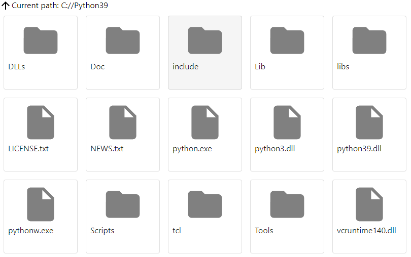

# Tauri vs Electron framework
Is Tauri a better choice than electron in 2021? 

## Testing environment

We will create new React app with CRA (create-react-app) 4.0.3 consisting on a simple file explorer. At the top of the page we will have the display of the current folder and an icon allowing to go to the parent folder. The main part of the application will simply display the files and folders in the current folder.

We will use several npm package to achieve this :
- [MUI framework 5.0.6](https://mui.com/) which provides material UI components
- [SASS 1.43.4](https://github.com/sass/dart-sass) to allow to use and import scss files



The main UI component will consume a service named File.js which will provide the contents of a specifided folder path :
```javascript
export function getFolderContent(path) {
	// implementation will change depending the framework (electron node API vs tauri API)
});
```

## Test results
### Bundle size
| Framework | OS | Bundle size (installer)  | Main executable size |
|--|--|--|--|
| Electron  15.3.0 | Windows 11 | 83 MB | 137 MB|
| Tauri X.X.X | Windows 11 | 7MB | 4MB |

### Memory consumption
| Framework | OS | Number of processes | Total RAM used  |
|--|--|--|--|
| Electron  15.3.0 | Windows 11 |4| 138 MB | 
| Tauri X.X.X | Windows 11 |8| 110 MB | 

### Executable launch speed 
| Framework | OS | First launch after build | Second launch | 
|--|--|--|--|
| Electron  15.3.0 | Windows 11 | 9940 ms | 1420 ms | 
| Tauri X.X.X | Windows 11 | 1230 ms | 1120 ms | 
